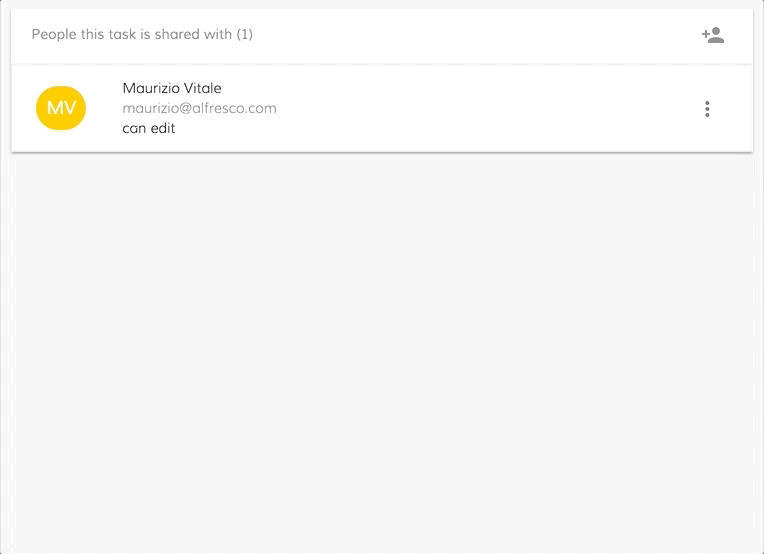

# People Component

Displays users involved with a specified task


## Contents

-   [Basic Usage](#basic-usage)
-   [Class members](#class-members)
    -   [Properties](#properties)
-   [Details](#details)
    -   [How to customize the people component behavior](#how-to-customize-the-people-component-behavior)
    -   [Involve People single click and close search](#involve-people-single-click-and-close-search)
    -   [Involve People single click without close search](#involve-people-single-click-without-close-search)
    -   [Involve People double click and close search](#involve-people-double-click-and-close-search)
    -   [Involve People double double without close search](#involve-people-double-double-without-close-search)

## Basic Usage

```html
<adf-people 
    [people]="YOUR_INVOLVED_PEOPLE_LIST" 
    [taskId]="YOUR_TASK_ID"
    [readOnly]="YOUR_READ_ONLY_FLAG">
</adf-people>
```

## Class members

### Properties

| Name | Type | Default value | Description |
| ---- | ---- | ------------- | ----------- |
| people | [`UserProcessModel`](../core/user-process.model.md)`[]` | \[] | The array of User objects to display. |
| readOnly | `boolean` | false | Should the data be read-only? |
| taskId | `string` | "" | The numeric ID of the task. |

## Details

### How to customize the people component behavior

The [people component](../process-services/people.component.md) provide two methods to customize the behavior:

-   involveUserAndCloseSearch: The selected user is going to be added and the search section closed
-   involveUserWithoutCloseSearch: The selected user is going to be added without close the search section

In this way will be easy customize the [people component](../process-services/people.component.md) to involve the user with the single or double click event:

### Involve People single click and close search

```html
<adf-people #people
    (row-click)="people.involveUserAndCloseSearch()"
    [people]="YOUR_INVOLVED_PEOPLE_LIST"
    [taskId]="YOUR_TASK_ID"
    [readOnly]="YOUR_READ_ONLY_FLAG">
</adf-people>
```




### Involve People single click without close search

```html
<adf-people #people
    (row-click)="people.involveUserWithoutCloseSearch()"
    [people]="YOUR_INVOLVED_PEOPLE_LIST"
    [taskId]="YOUR_TASK_ID"
    [readOnly]="YOUR_READ_ONLY_FLAG">
</adf-people>
```


### Involve People double click and close search

```html
<adf-people #people
    (row-dblclick)="people.involveUserAndCloseSearch()"
    [people]="YOUR_INVOLVED_PEOPLE_LIST"
    [taskId]="YOUR_TASK_ID"
    [readOnly]="YOUR_READ_ONLY_FLAG">
</adf-people>
```


### Involve People double double without close search

```html
<adf-people #people
    (row-dblclick)="people.involveUserWithoutCloseSearch()"
    [people]="YOUR_INVOLVED_PEOPLE_LIST"
    [taskId]="YOUR_TASK_ID"
    [readOnly]="YOUR_READ_ONLY_FLAG">
</adf-people>
```


